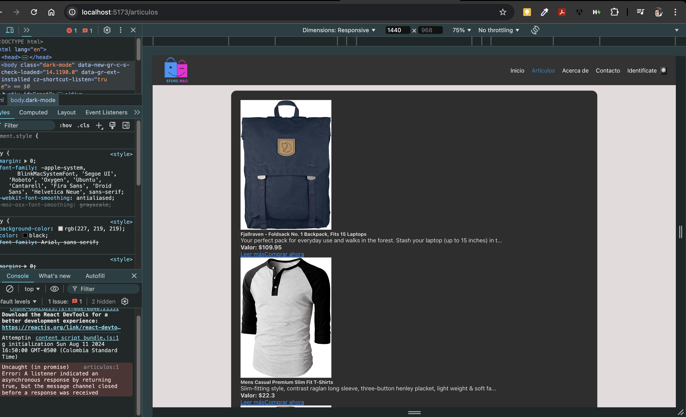
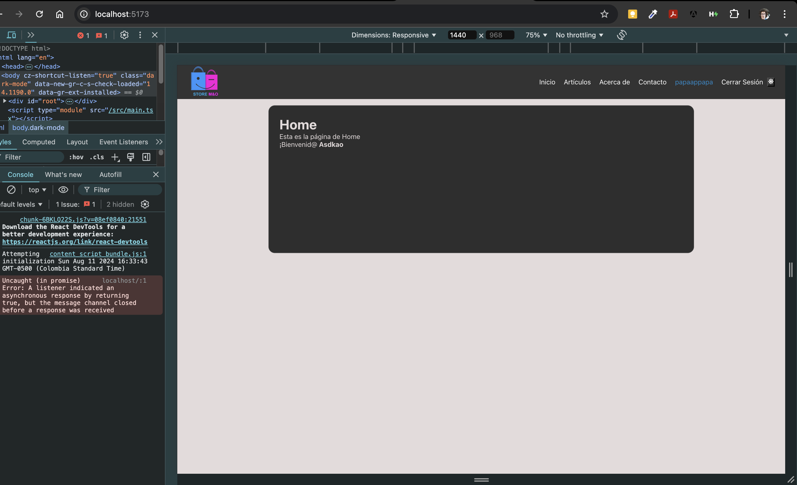
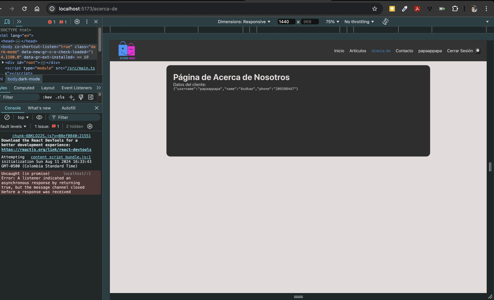
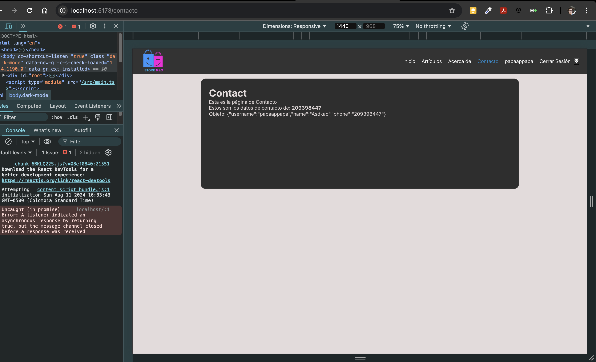
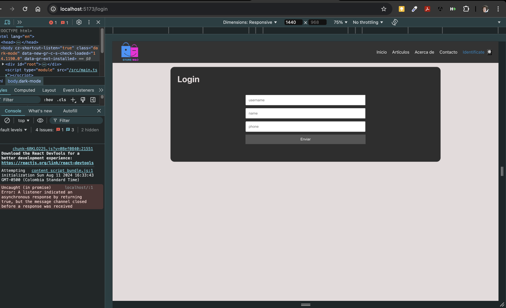

# E-commerce Store

Este es un proyecto de e-commerce simple desarrollado en React que permite a los usuarios explorar y comprar productos. La aplicación consume datos de una API falsa para mostrar los productos disponibles.


## Características

- **Listado de productos**: Muestra productos en grupos de dos por fila.
- 
- **Detalles del producto**: Cada producto incluye una imagen, título, descripción, y precio.
- 
- **Funcionalidad de compra**: Los usuarios pueden ver más detalles o proceder a la compra desde la página del producto.
- 


- **Autenticación simple**: Implementación básica de inicio de sesión para simular la autenticación del usuario.
- 

- 

## Tecnologías utilizadas

- **React**: Biblioteca principal para crear la interfaz de usuario.
- **React Router**: Gestión de enrutamiento para la navegación entre componentes.
- **Bootstrap**: Framework CSS para diseño responsivo y estilización rápida.
- **TypeScript**: Superset de JavaScript para tipado estático y detección temprana de errores.
- **Fake Store API**: API utilizada para obtener datos ficticios de productos.

## Instalación

1. **Clona este repositorio**:

   ```bash
   git clone https://github.com/tu-usuario/nombre-del-repositorio.git


